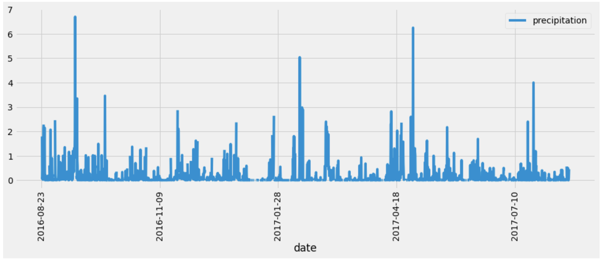
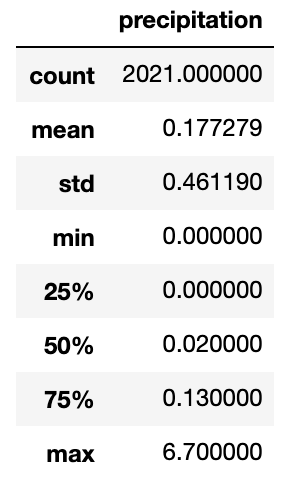

# Surfs_up

## Project Overview

We are given a task to analyze the weather and precipitation levels on a Hawaiian island, Oahu. Our client, W. Avy wants to know whether or not it's a good idea to invest money in a Surf and Ice Cream Shop there.

The data analyze is important to W. Avy as some precipitation is necessary to create a favorable flora and environment, but too much precipitation would make us miss out on business opportunities for the store.

## Resources:

- Data Source: hawaii.sqlite
- Software: anaconda3, python 3.7.7, jupyter notebook, flask
- Library: matplotlib, pandas, numpy, datetime, sqlalchemy, and flask

## Project Analysis

Having created a bar chart based on the sqlite file provided by W. Avy, we can see that there are some trends, such as some months having more precipitation than others.
The bar chart shows precipitation amounts for every day between Aug - 2016 to Aug - 2017.

We also calculated some statistics on the precipitation levels for same time period:

## Challenge Overview

W. Avy liked the above analysis, and he wanted more information about temperature trends before opening the surf shop. Specifically, he wanted temperature data for the months of June and December in Oahu, in order to determine if the surf and ice cream shop business is sustainable year-round.

## Challenge Analysis

Analysis was done by extracting all of June temperature data and December temperature data. The statistics are displayed below.

